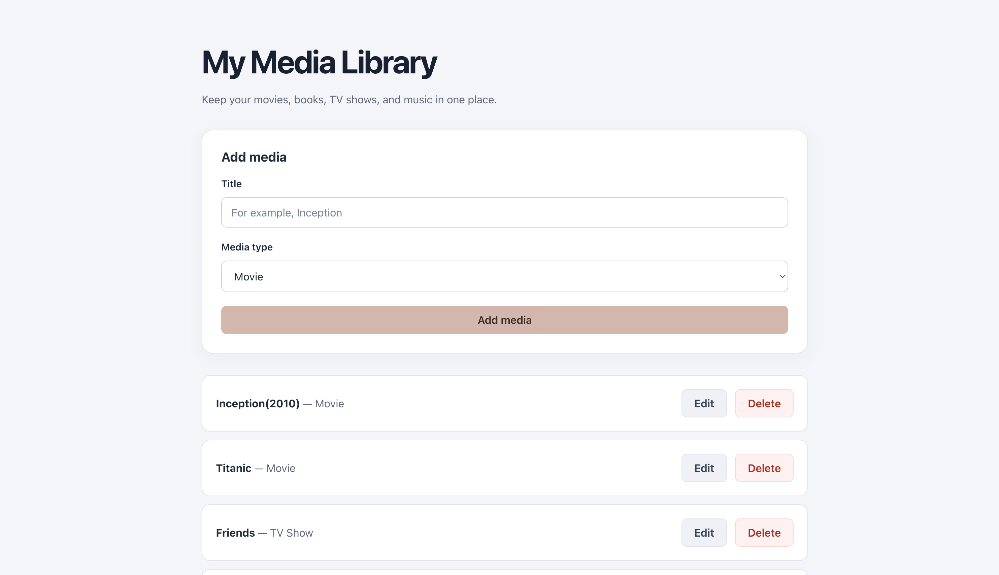

# Saved Media Library

A full-stack application for keeping track of movies, books, TV shows,
and songs. Built with a React frontend and a C# ASP.NET Core API,
using Entity Framework Core and SQLite for persistent storage.

I built this project to gain hands-on experience with .NET and practice
connecting a React interface to my own REST API.

## Preview



## Technologies

- **Frontend:** React, JavaScript, CSS, Vite
- **Backend:** C#, .NET 10, ASP.NET Core Minimal APIs
- **Database:** SQLite and Entity Framework Core
- **Tools:** Git, GitHub, ESLint, curl

## Features

- View saved media
- Add an item with a title and media type
- Edit an existing item or cancel editing
- Delete an item with confirmation
- Validate required fields
- Display loading states and error messages
- Disable controls while changes are being saved
- Preserve data after refreshing the page or restarting the backend
- Responsive layout with a muted nude-pink theme

## How It Works

The React frontend sends HTTP requests to the ASP.NET Core API.
The API validates incoming data and uses Entity Framework Core to
read and write records in SQLite.

Responses are returned as JSON, and React updates the displayed list
after a successful operation.

During local development, Vite forwards requests beginning with `/api`
to the backend and removes that prefix. For example, `/api/media`
is forwarded to `http://localhost:5082/media`.

## Run Locally

### Prerequisites

- .NET 10 SDK
- A Node.js version supported by Vite (developed using Node.js 24)
- npm

### 1. Clone the repository

```bash
git clone https://github.com/faridabelal/saved-media-api.git
cd saved-media-api
```

### 2. Start the backend

From the repository root:

```bash
dotnet restore
dotnet run --urls http://localhost:5082
```

The application creates a local `media.db` file and its tables on first
run. The database starts empty.

Leave this terminal running.

### 3. Start the frontend

In a separate terminal, navigate to the repository's `client` folder:

```bash
cd client
npm install
npm run dev
```

Open the local URL printed by Vite, usually:

```text
http://localhost:5173
```

Both servers must be running to use the application locally.

## API Endpoints

Backend base URL: `http://localhost:5082`

| Method | Endpoint | Purpose | Success response |
|--------|----------|---------|------------------|
| GET | /media | Retrieve all items | 200 OK |
| GET | /media/{id} | Retrieve one item | 200 OK |
| POST | /media | Create an item | 201 Created |
| PUT | /media/{id} | Update an item's title and media type | 200 OK |
| DELETE | /media/{id} | Delete an item | 204 No Content |

Requests with empty or whitespace-only titles or media types return
`400 Bad Request`. Requests for an individual item that does not exist
return `404 Not Found`.

### Example: Add a movie

```bash
curl -i -X POST http://localhost:5082/media \
  -H "Content-Type: application/json" \
  -d '{"title":"Inception","mediaType":"Movie"}'
```

Example response body:

```json
{
  "id": 1,
  "title": "Inception",
  "mediaType": "Movie"
}
```

The database generates the ID, so its value may differ.

## Project Structure

- `Program.cs` — API endpoints and database configuration
- `MediaItem.cs` — Media item model
- `MediaDBContext.cs` — Entity Framework Core database context
- `client/src/App.jsx` — React interface and API requests
- `client/src/App.css` — Application styling
- `client/src/index.css` — Global styles
- `client/vite.config.js` — Frontend development server and API proxy

## Testing and Verification

Manually tested using curl and the browser:

- Creating, retrieving, updating, and deleting media
- Rejecting invalid inputs
- Returning errors for missing records
- Preserving additions, updates, and deletions after backend restarts
- Adding, editing, and deleting items through the React interface
- Confirming saved changes remain after refreshing the page

Frontend lint and production build checks also passed:

```bash
cd client
npm run lint
npm run build
```

These checks verify code rules and build success; automated behavioral
tests have not been added yet.

## Current Scope

This is a local learning project. It does not currently include:

- Authentication or user-specific collections
- Automated tests
- Search or filtering
- A public deployment

The frontend offers four media types, while the backend currently
validates only that the title and media type are not blank.

Database tables are created using `EnsureCreated()`. Database migrations
have not been configured.

The Vite API proxy works during local development. A production deployment
would need its own API routing configuration.

## What I Practiced

- Building REST endpoints with ASP.NET Core
- Working with C# models and Entity Framework Core
- Persisting data in SQLite
- Using React state, effects, and controlled forms
- Sending HTTP requests with fetch
- Handling loading, errors, and successful responses
- Updating the interface after database changes
- Tracking project changes with Git and GitHub